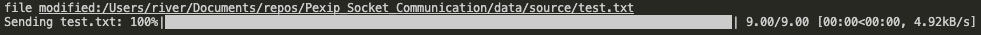
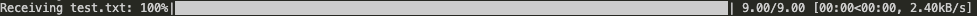

# Server-Client File Backup using Socket Communication

## Introduction 
The aim of this project is to create a programme designed to back up file modifications to a remote (or local) server. The estimated time devoted to this project is around 4-5 hours.

client side interface example

server side interface example


## Getting Started
Install the below dependencies to run the projects on a local device
1. Dependencies (Python Libraries)
    * tqdm
    * shutil
    * watchdog
2. Essential Logic
    * The client runs a file monitor script to check for any changes to files in the source directory. The filename and filesize is then sent to the server and then the file is sent and saved to the specified destination directory. A local directory called [server_version](./server_version) is created and a copy of the file is saved and used for future comparison to check if file modifications are different to the server version. This prevents redundant file backup and allows the client to check which version is in the server's destination directory. Originally filecomp.cmp was used to compare files but this was seen to be ineffective. Comparing the binary files was also found to be ineffective due to file formatting issues. The files were therefore compared by directly equating lines. If one or more lines are the same as the remote version then the file will not be sent.

## Build and Test
1. Open a new terminal and set up the server

Navigate to repository directory and run server.py where DESTINATION_DIR is the desired destination directory and IP is the server IP address.

``` $ cd Socket_Communication ```

``` $ python3 dev/server.py DESTINATION_DIR IP``` for MacOS or ``` $ python dev/server.py DESTINATION_DIR IP``` for Windows or Linux


2. Open a second terminal and set up the client

Navigate to repository directory and run client.py where SOURCE_DIR is the desired source directory and IP is the server IP address.

``` $ cd Socket_Communication ```

``` $ python3 dev/client.py SOURCE_DIR IP``` for MacOS or ``` $ python dev/client.py SOURCE_DIR IP``` for Windows or Linux

3. For local testing a source and destination repository have been created and localhost ("127.0.0.1") can be used by entering

``` $ python3 dev/server.py data/dest localhost```

``` $ python3 dev/client.py data/source localhost```

4. Modify [test.docx](./data/source/test.txt) to test programme operation.

## Scripts
### Python Files
* [server.py](./dev/server.py) sets up the server
* [client.py](./dev/client.py) initiates file backup
* [file_monitor.py](./dev/file_monitor.py) monitors files in the specified directory


## To Do
* Optimise file comparison to adjust similarity threshold
The file comparison currently only compares lines to check for file duplication. File comparison criteria can be integrated to fit the use case of the application.
* Add optional features to allow force backup requests
